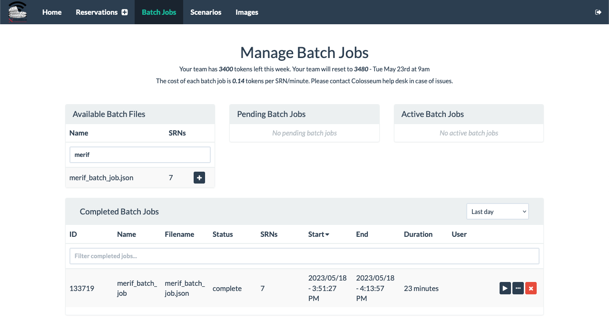

# Reproducibility Tutorial

The reproducibility of Colosseum will be demonstrated through the execution of batch experiments (or batch jobs).

In batch mode, user radio applications and scenarios are controlled automatically by Colosseum.
Users will need to have their container pre-configured to use the Radio API which will allow Colosseum to control their radio applications.
Users need to be aware that in batch mode the container does not have access to the `can0` interface, which restricts access from the container to some Colosseum resources, specifically:

- Containers will not have access to the teams’ network storage folders. All radio application files need to be included in the container;
- Containers will not be accessible by SSH through the SSH Gateway.

More information on batch jobs can be found [here](https://colosseumneu.freshdesk.com/support/solutions/articles/61000253519-batch-mode-format-and-process)


## Batch Jobs for Automatic Cellular Network Experiments

We will use the srsRAN-based [SCOPE](https://openrangym.com/ran-frameworks/scope) framework (and, specifically, the public `scope-merif` LXC container) to execute an automatic batch job with the Colosseum wireless network emulator. The credentials for this LXC container are `root`/`scope` in case of an interactive experiment.

### Preparing the Batch Job

First, we need to create a batch configuration file (named, `merif_batch_job.json`) on the Colosseum `file-proxy` server, in the path `/share/nas/<team-name>/batch/` (replace `<team-name>` with the name of your team). (Instructions on how to access Colosseum resources can be found [here](https://colosseumneu.freshdesk.com/support/solutions/articles/61000253362-accessing-colosseum-resources).)
This file instructs Colosseum on how many nodes to instantiate and which LXC container to start on each node, among others.
The content of the `merif_batch_job.json`, also available [here](batch/merif_batch_job.json) is as follows:

https://github.com/colosseum-wiot/colosseum-merif-2023/blob/b0563c58833bd204c4f779c7e066630e34beeda3/reproducibility/batch/merif_batch_job.json#L1-L64

Then, we need to create a radio configuration file (named, `merif_radio_config.conf`) on the Colosseum `file-proxy` in the path `/share/nas/<team-name>/config/` (replace `<team-name>` with the name of your team).
This file is used to pass some extra parameters to the LXC container that will be created by Colosseum.
The content of the `merif_radio_config.conf`, also available [here](config/merif_radio_config.conf) is as follows:

https://github.com/colosseum-wiot/colosseum-merif-2023/blob/b0563c58833bd204c4f779c7e066630e34beeda3/reproducibility/config/merif_radio_config.conf#L1-L19


## Running the Batch Job

After creating batch and radio configuration files, the batch job is ready to be run.
We log into the [Colosseum experiments portal](https://experiments.colosseum.net/) and open the [Batch Job page](https://experiments.colosseum.net/batch).

In this page, we see four main sections (see figure below):
- Available Batch Files, which lists the available batch files contained in the `/share/nas/<team-name>/batch/` directory on the `file-proxy` server
- Pending Batch Jobs, which lists batch jobs that have been scheduled for execution
- Active Batch Jobs, which lists the batch jobs that are currently running
- Completed Batch Jobs, which lists the batch jobs that have been completed



We start the batch job by clicking on the `+` button next to the name of the batch job in the "Available Batch Files" section.
At this point, the batch job should appear first in the "Pending Batch Jobs," then in the "Active Batch Jobs," and after completing, in the "Completed Batch Jobs" sections.


## Retrieving Batch Job Data

After the batch job ends, we can download the generated data from Colosseum `file-proxy` server.
To do this, first write down the reservation ID of the completed batch job, e.g., `133719` in the example above.
Then, open a new terminal window and download the data from the `file-proxy` server in the current directory through the following `scp` command (replace `<team-name>` with the name of your team).

```bash
scp -r file-proxy:/share/nas/<team-name>/RESERVATION-133719 .
```

Finally, copy the generated figures (i.e., `tx_brate downlink [Mbps].eps`, `tx_pkts downlink.eps`, and `dl_buffer [bytes].eps`) in the current directory by running the following command in the terminal:

```bash
find RESERVATION-133719/ -type f -name "*.eps" -exec cp {} . \;
```